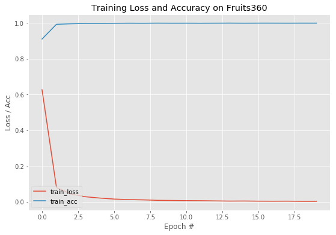

# fruits-360
This project uses fruits-360 data set and tries to model a resnet18 model implemented in pyTorch via transfer learning concept.

Research paper : https://www.researchgate.net/publication/321475443_Fruit_recognition_from_images_using_deep_learning
                 http://vixra.org/pdf/1801.0050v1.pdf

Dataset : https://www.kaggle.com/moltean/fruits

Model 1
------------------------
- Training Loss Summary

- Test Loss Summary

Training results are pretty good with just 20 epochs over the dataset with 128 batch size.

**Classification Report**

 |  Classes |  precision |  recall |  f1-score |  support |  
 |     ---   |     ---   |     ---   |     ---   |     ---  |    
 |  Apple Braeburn |  0.85 |  1.00 |  0.92 |  164 |  
 |  Apple Crimson Snow |  0.99 |  0.99 |  0.99 |  148 |  
 |  Apple Golden 1 |  1.00 |  0.99 |  1.00 |  164 |  
 |  Apple Golden 2 |  1.00 |  0.84 |  0.91 |  164 |  
 |  Apple Golden  3 |  0.70 |  1.00 |  0.83 |  161 |  
 |  Apple Granny Smith |  0.99 |  0.74 |  0.85 |  164 |  
 |  Apple Pink Lady |  0.99 |  1.00 |  1.00 |  152 |  
 |  Apple Red 1 |  0.96 |  0.99 |  0.98 |  164 |  
 |  Apple Red 2 |  0.99 |  0.82 |  0.89 |  164 |  
 |  Apple Red 3 |  0.98 |  0.97 |  0.97 |  144 |  
 |  Apple Red Delicious |  1.00 |  1.00 |  1.00 |  166 |  
 |  Apple Red Yellow 1 |  1.00 |  0.99 |  0.99 |  164 |  
 |  Apple Red Yellow 2 |  1.00 |  1.00 |  1.00 |  219 |  
 |  Apricot |  1.00 |  1.00 |  1.00 |  164 |  
 |  Avocado |  1.00 |  1.00 |  1.00 |  143 |  
 |  Avocado ripe |  0.99 |  1.00 |  0.99 |  166 |  
 |  Banana  |  1.00 |  1.00 |  1.00 |  166 |  
 |  Banana Lady Finger |  1.00 |  1.00 |  1.00 |  152 |  
 |  Banana Red |  1.00 |  1.00 |  1.00 |  166 |  
 |  Cactus fruit |  1.00 |  1.00 |  1.00 |  166 |  
 |  Cantaloupe 1 |  1.00 |  1.00 |  1.00 |  164 |  
 |  Cantaloupe 2 |  1.00 |  1.00 |  1.00 |  164 |  
 |  Carambula |  1.00 |  1.00 |  1.00 |  166 |  
 |  Cherry  1 |  1.00 |  1.00 |  1.00 |  164 |  
 |  Cherry  2 |  0.96 |  1.00 |  0.98 |  246 |  
 |  Cherry Rainier |  1.00 |  0.96 |  0.98 |  246 |  
 |  Cherry Wax Black |  1.00 |  1.00 |  1.00 |  164 |  
 |  Cherry Wax Red |  1.00 |  1.00 |  1.00 |  164 |  
 |  Cherry Wax Yellow |  1.00 |  1.00 |  1.00 |  164 |  
 |  Chestnut |  1.00 |  1.00 |  1.00 |  153 |  
 |  Clementine |  1.00 |  0.95 |  0.98 |  166 |  
 |  Cocos |  1.00 |  1.00 |  1.00 |  166 |  
 |  Dates |  1.00 |  1.00 |  1.00 |  166 |  
 |  Granadilla |  1.00 |  1.00 |  1.00 |  166 |  
 |  Grape Blue |  0.99 |  1.00 |  1.00 |  328 |  
 |  Grape Pink |  0.99 |  1.00 |  0.99 |  164 |  
 |  Grape White |  0.95 |  1.00 |  0.97 |  166 |  
 |  Grape White 2 |  1.00 |  1.00 |  1.00 |  166 |  
 |  Grape White 3 |  1.00 |  1.00 |  1.00 |  164 |  
 |  Grape White 4 |  1.00 |  1.00 |  1.00 |  158 |  
 |  Grapefruit Pink |  1.00 |  1.00 |  1.00 |  166 |  
 |  Grapefruit White |  0.99 |  1.00 |  1.00 |  164 |  
 |  Guava |  1.00 |  1.00 |  1.00 |  166 |  
 |  Hazelnut |  1.00 |  1.00 |  1.00 |  157 |  
 |  Huckleberry |  1.00 |  1.00 |  1.00 |  166 |  
 |  Kaki |  1.00 |  0.90 |  0.95 |  166 |  
 |  Kiwi |  1.00 |  1.00 |  1.00 |  156 |  
 |  Kohlrabi |  1.00 |  1.00 |  1.00 |  157 |  
 |  Kumquats |  1.00 |  1.00 |  1.00 |  166 |  
 |  Lemon |  1.00 |  0.99 |  1.00 |  164 |  
 |  Lemon Meyer |  1.00 |  1.00 |  1.00 |  166 |  
 |  Limes |  1.00 |  1.00 |  1.00 |  166 |  
 |  Lychee |  1.00 |  1.00 |  1.00 |  166 |  
 |  Mandarine |  1.00 |  1.00 |  1.00 |  166 |  
 |  Mango |  1.00 |  1.00 |  1.00 |  166 |  
 |  Mangostan |  1.00 |  1.00 |  1.00 |  102 |  
 |  Maracuja |  0.99 |  0.98 |  0.98 |  166 |  
 |  Melon Piel de Sapo |  0.99 |  1.00 |  1.00 |  246 |  
 |  Mulberry |  1.00 |  1.00 |  1.00 |  164 |  
 |  Nectarine |  0.91 |  1.00 |  0.95 |  164 |  
 |  Onion Red |  0.89 |  1.00 |  0.94 |  150 |  
 |  Onion Red Peeled |  1.00 |  1.00 |  1.00 |  155 |  
 |  Onion White |  1.00 |  0.84 |  0.91 |  146 |  
 |  Orange |  1.00 |  1.00 |  1.00 |  160 |  
 |  Papaya |  1.00 |  1.00 |  1.00 |  164 |  
 |  Passion Fruit |  1.00 |  0.96 |  0.98 |  166 |  
 |  Peach |  0.97 |  0.96 |  0.96 |  164 |  
 |  Peach 2 |  1.00 |  1.00 |  1.00 |  246 |  
 |  Peach Flat |  0.87 |  1.00 |  0.93 |  164 |  
 |  Pear |  1.00 |  0.86 |  0.92 |  164 |  
 |  Pear Abate |  1.00 |  1.00 |  1.00 |  166 |  
 |  Pear Kaiser |  1.00 |  1.00 |  1.00 |  102 |  
 |  Pear Monster |  1.00 |  0.99 |  1.00 |  166 |  
 |  Pear Red |  1.00 |  1.00 |  1.00 |  222 |  
 |  Pear Williams |  1.00 |  1.00 |  1.00 |  166 |  
 |  Pepino |  1.00 |  0.98 |  0.99 |  166 |  
 |  Pepper Green |  1.00 |  1.00 |  1.00 |  148 |  
 |  Pepper Red |  1.00 |  1.00 |  1.00 |  222 |  
 |  Pepper Yellow |  1.00 |  1.00 |  1.00 |  222 |  
 |  Physalis |  1.00 |  1.00 |  1.00 |  164 |  
 |  Physalis with Husk |  1.00 |  1.00 |  1.00 |  164 |  
 |  Pineapple |  1.00 |  1.00 |  1.00 |  166 |  
 |  Pineapple Mini |  1.00 |  1.00 |  1.00 |  163 |  
 |  Pitahaya Red |  0.99 |  1.00 |  1.00 |  166 |  
 |  Plum |  0.99 |  1.00 |  1.00 |  151 |  
 |  Plum 2 |  1.00 |  1.00 |  1.00 |  142 |  
 |  Plum 3 |  0.99 |  1.00 |  0.99 |  304 |  
 |  Pomegranate |  0.99 |  0.93 |  0.96 |  164 |  
 |  Pomelo Sweetie |  1.00 |  1.00 |  1.00 |  153 |  
 |  Potato Red Washed |  0.98 |  0.99 |  0.98 |  151 |  
 |  Quince |  0.99 |  1.00 |  0.99 |  166 |  
 |  Rambutan |  1.00 |  1.00 |  1.00 |  164 |  
 |  Raspberry |  1.00 |  1.00 |  1.00 |  166 |  
 |  Redcurrant |  1.00 |  1.00 |  1.00 |  164 |  
 |  Salak |  1.00 |  1.00 |  1.00 |  162 |  
 |  Strawberry |  0.99 |  1.00 |  1.00 |  164 |  
 |  Strawberry Wedge |  1.00 |  0.99 |  1.00 |  246 |  
 |  Tamarillo |  1.00 |  1.00 |  1.00 |  166 |  
 |  Tangelo |  1.00 |  1.00 |  1.00 |  166 |  
 |  Tomato 1 |  1.00 |  0.92 |  0.96 |  246 |  
 |  Tomato 2 |  0.95 |  1.00 |  0.98 |  225 |  
 |  Tomato 3 |  0.94 |  1.00 |  0.97 |  246 |  
 |  Tomato 4 |  1.00 |  1.00 |  1.00 |  160 |  
 |  Tomato Cherry Red |  1.00 |  1.00 |  1.00 |  164 |  
 |  Tomato Maroon |  1.00 |  1.00 |  1.00 |  127 |  
 |  Tomato Yellow |  1.00 |  1.00 |  1.00 |  153 |  
 |  Walnut |  1.00 |  1.00 |  1.00 |  249 |  
 |  accuracy |  |  |0.99 |  18447 |  
 |  macro avg | 0.99 |  0.99 |  0.99 |  18447 |  
 |  weighted avg |  0.99 |  0.99 |  0.99 |  18447 | 
